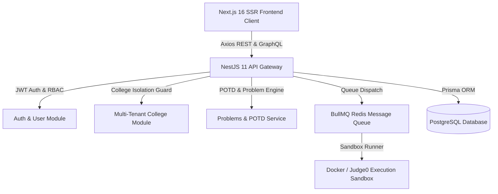

# **CodePlatform / TechLearns — Platform Features & Technical Completion Report**

**Document Version**: 1.0  
**Generated Date**: September 22, 2026  
**Platform Style**: **CodeChef & LeetCode Style** Learning and Competitive Programming Platform  
**Technology Stack**: **Next.js 16 (SSR-First App Router)** + **NestJS 11** + **Prisma ORM** + **PostgreSQL** + **Redis & BullMQ** + **Docker Sandbox Engine**  

---

## **Table of Contents**
1. [**Executive System Architecture**](#1-executive-system-architecture)
2. [**Role-Wise Feature Breakdown**](#2-role-wise-feature-breakdown)
   - [2.1 **Super Admin & Platform Admin**](#21-super-admin--platform-admin-super_admin-platform_admin)
   - [2.2 **Institution Admin & College Dean**](#22-institution-admin--college-dean-institution_admin-college_admin)
   - [2.3 **Faculty, Instructors & Mentors**](#23-faculty-instructors--mentors-faculty)
   - [2.4 **Students & Competitive Programmers (CodeChef Style Arena)**](#24-students--competitive-programmers-student--codechef-style-arena)
   - [2.5 **Public & Unauthenticated Visitors**](#25-public--unauthenticated-visitors)
3. [**Summary of Completed Engineering Work & Verification**](#3-summary-of-completed-engineering-work--verification)
   - [3.1 **Backend Architecture & Services (/server)**](#31-backend-architecture--services-server)
   - [3.2 **Frontend Modernization & Real API Integration (/client)**](#32-frontend-modernization--real-api-integration-client)
   - [3.3 **Hardening & Bug Fixes**](#33-hardening--bug-fixes)
4. [**Test Results & Validation Metrics**](#4-test-results--validation-metrics)

---

## 1. **Executive System Architecture**

---

## 2. **Role-Wise Feature Breakdown**

### 2.1 **Super Admin & Platform Admin (`SUPER_ADMIN`, `PLATFORM_ADMIN`)**
Responsible for global platform administration, cross-institutional monitoring, system configuration, and problem bank curation.

| Feature Area | Key Capabilities | Routes & Backend Endpoints |
| :--- | :--- | :--- |
| **Global Control Dashboard** | Real-time submission telemetry, velocity metrics, queue health, database diagnostics | UI: `/superadmin` API: **`ADMIN_METRICS_QUERY`** |
| **Institution Directory** | Full CRUD for colleges/universities, domain isolation, tier assignments | UI: `/superadmin/institutions`, `/superadmin/colleges` API: **`GET/POST/PATCH/DELETE /colleges`** |
| **Platform Problem Bank** | Problem authoring, Markdown statements, test cases, memory/time limits, publishing status | UI: `/superadmin/problems` API: **`/problems`** |
| **POTD Scheduler** | Set/schedule Problem of the Day for specific calendar dates with custom bonus points | API: **`POST /problems/potd/set`** |
| **User & Role Governance** | User directory, role promotion, campus admin onboarding, audit logs | UI: `/superadmin/users` API: **`/users`** |

---

### 2.2 **Institution Admin & College Dean (`INSTITUTION_ADMIN`, `COLLEGE_ADMIN`)**
Responsible for campus-level operations, student cohorts, faculty assignments, and institutional performance tracking.

| Feature Area | Key Capabilities | Routes & Backend Endpoints |
| :--- | :--- | :--- |
| **Campus Analytics** | Institutional solve rates, active student velocity, batch comparisons, leaderboard standings | UI: `/institution-admin/analytics` |
| **Batch & Cohort Management** | Create and manage cohorts (e.g., **"Batch 2026 CS-A"**), graduation years, student counts | UI: `/institution-admin/batches` API: **`/batches`** |
| **Student Roster & Invitations** | Single and bulk student invitations via email tokens; CSV roster upload and export | UI: `/institution-admin/students` API: **`POST /users/bulk-invite`** |
| **Faculty Assignment** | Onboard faculty members and assign them to specific college departments | UI: `/institution-admin/faculty` API: **`POST /colleges/:id/members`** |
| **Tenant Data Isolation** | College-scoped problem visibility and submissions guarded by **`CollegeAccessGuard`** | Guard: **`CollegeAccessGuard`** |

---

### 2.3 **Faculty, Instructors & Mentors (`FACULTY`)**
Responsible for curriculum delivery, coding assessments, student evaluation, and contest management.

| Feature Area | Key Capabilities | Routes & Backend Endpoints |
| :--- | :--- | :--- |
| **Curriculum & Courses** | Build structured modules, upload video/text lessons, assign mandatory problem sets | UI: `/courses`, `/superadmin/courses` API: **`/courses`** |
| **Campus Problem Authoring** | Create college-exclusive coding problems with hidden test cases and custom constraints | UI: `/problems/create` API: **`POST /problems`** |
| **Contest Management** | Schedule and host college-wide coding contests and hackathons with timer locks | UI: `/contests` API: **`/contests`** |
| **Plagiarism Detection** | Automated pairwise code similarity analysis powered by tokenized AST comparison | Service: **`PlagiarismService`** |

---

### 2.4 **Students & Competitive Programmers (`STUDENT`) — CodeChef Style Arena**
End-users engaging in self-paced learning, daily challenges, coding contests, and verified skill tracking.

| Feature Area | Key Capabilities | Routes & Backend Endpoints |
| :--- | :--- | :--- |
| **Problem Solving Workspace** | Split-pane code editor (**C++, Java, Python, Go, Rust, TS**) with real-time test run and submit verdicts | UI: `/problems/[slug]` Service: **`CompilerService`** |
| **Problem Archive & Filtering** | Structured list-table directory with search, topic tags, difficulty levels (**Easy / Medium / Hard**), and CSV export | UI: `/problems` Component: **`ProblemArchiveClient`** |
| **Daily POTD & Solve Streaks** | Daily problem challenges with streak multiplier tracking (**up to 2.5×**) and activity heatmap | API: **`GET /problems/potd/today`** API: **`GET /problems/user/streak`** |
| **Contests Arena (CodeChef Format)** | **CodeChef Style Multi-Division Competitions** (**Division 1 / Division 2 / Division 3**) with countdown timers, penalty scoring, and rank changes | UI: `/contests`, `/contests/[id]` |
| **Live Leaderboard & Ratings (CodeChef Star Ratings)** | **CodeChef Dynamic Star Tiers** (**1-Star ★ to 7-Star ★★★★★★★**), global standings, and college league rank | UI: `/leaderboard` Component: **`RatingHistoryChart`** |
| **Verified Skill Passport** | Cryptographically verifiable student portfolio, Jira story velocity, GitHub PR ledger, and Cloud IDE workspace | UI: `/students/skill-passport` Component: **`SkillPassportClient`** |
| **Student Profile & Activity** | View submission history, solved stats by difficulty, rating changes, and 2FA credentials | UI: `/students/profile`, `/students/[username]` |

---

### 2.5 **Public & Unauthenticated Visitors**
| Feature Area | Key Capabilities | Routes |
| :--- | :--- | :--- |
| **Landing Hero Portal** | Real-time platform metrics, feature highlights, and campus CTA | UI: `/` (`src/app/page.tsx`) |
| **Authentication Portal** | User registration, JWT login, token-based invitation activation | UI: `/login`, `/register`, `/accept-invitation` |
| **Public Problems & Leaderboard** | Browse public problem bank and inspect live platform leaderboards | UI: `/problems`, `/leaderboard` |

---

## 3. **Summary of Completed Engineering Work & Verification**

### 3.1 **Backend Architecture & Services (`/server`)**
1. **Prisma Query Deduplication**:
   - Upgraded accepted-submissions query in **`UsersService`** to perform direct database-level grouping for optimized accepted-problem tracking.
2. **Robust POTD Persistence**:
   - Engineered multi-tier persistence in **`PotdService`**: Primary PostgreSQL (**`prisma.problemOfTheDay`**), secondary Redis hash cache (**`potd:assignments`**), and in-memory process fallback.
3. **Tenant & Role Security**:
   - Verified that **`CollegeAccessGuard`** strictly enforces tenant boundary isolation across college problems, batches, and student rosters.
4. **Outbox & Invitation Delivery**:
   - Integrated Mailgun / Local SMTP mail transport with outbox logging and activation URL token sanitization.

### 3.2 **Frontend Modernization & Real API Integration (`/client`)**
1. **Removal of Mock / Hardcoded Data**:
   - Replaced legacy static mocks with live backend endpoints via typed **`apiService`** using **Axios and GraphQL**.
   - Connected user profile statistics, solved counts, submission activity heatmaps, and rating history directly to live database records.
2. **List-Table Presentation Standard**:
   - Refactored problems explorer, contests dashboard, and student rosters into clean, high-density **list-table layouts** with search, pagination, and CSV export.
3. **CSV Injection Protection**:
   - Applied **`sanitizeCsvField`** across all data tables to neutralize potential spreadsheet formula injection payloads (`=`, `+`, `-`, `@`).

### 3.3 **Hardening & Bug Fixes**
1. **Authentication Error Demarcation in SkillOS Route**:
   - Updated `client/src/app/api/skillos/workspace/route.ts` to return **`401 Unauthorized`** only for genuinely invalid credentials, while returning **`502 Bad Gateway` / `503 Service Unavailable`** for upstream network and server errors.
   - Replaced truncated 4-character ID logic with full, unique identifiers (**`corporateId`**) to ensure distinct Cloud IDE workspaces.
2. **Skill Passport Async Guarding & URL Encoding**:
   - Added cancellation tracking (**`isCancelled`**) to **`QRCodeCanvas`**'s `useEffect` in `SkillPassportClient.tsx` to prevent race conditions from asynchronous `QRCode.toDataURL` calls after unmount.
   - Wrapped **`corporateId`** in **`encodeURIComponent`** when building external verification URLs.
3. **Rating History Chart**:
   - Updated `RatingHistoryChart.tsx` so unranked users render a neutral **`—`** rather than defaulting artificially to `#1`.

---

## 4. **Test Results & Validation Metrics**

| Verification Test | Command | Target | Status |
| :--- | :--- | :--- | :--- |
| **Backend Unit & Integration Tests** | `pnpm --filter server test` | `/server` (Vitest) | **144 / 144 Passed (27 test files - 100%)** |
| **Backend Static Analysis** | `pnpm --filter server lint` | `/server` (Oxlint) | **0 Errors, 0 Warnings (173 files)** |
| **Frontend Production Build** | `pnpm --filter client build` | `/client` (Next.js 16 Turbopack) | **0 Errors (All 63 routes compiled cleanly)** |

---

*Report prepared and validated for the CodePlatform / TechLearns development repository.*
