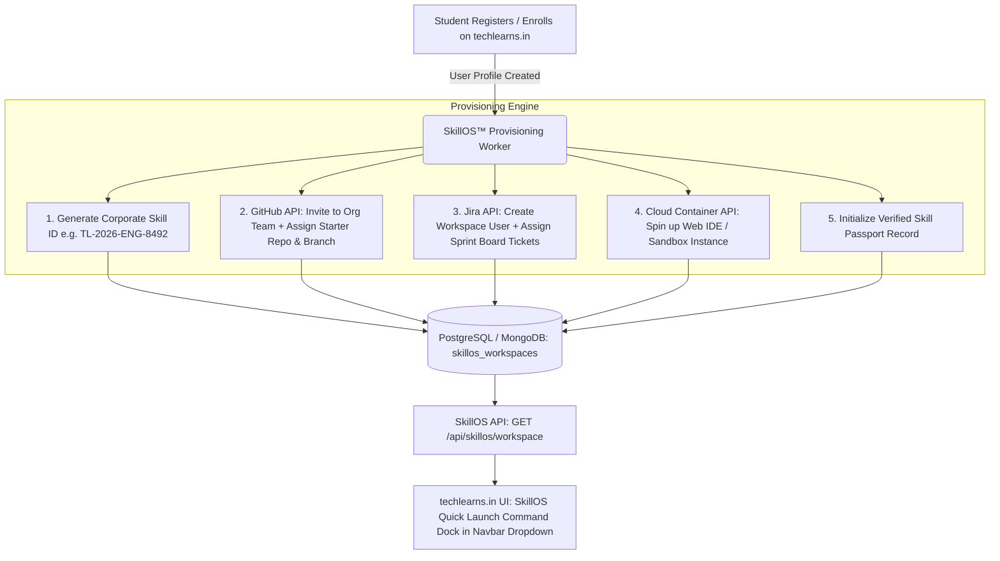

# Engineering Specification: SkillOS™ Corporate Workspace & Credentials Engine

**Target Platform:** [techlearns.in](https://techlearns.in)  
**Feature:** SkillOS™ Automated Corporate Environment, Web-Based Developer ID, GitHub & Jira Provisioning Engine  
**Document Purpose:** Forwardable Technical Specification for Engineering & Backend/Frontend Teams  

---

## 1. Concept & Product Overview

**SkillOS™** is techlearns' core competitive USP—a simulated **Corporate Operating System** provisioned automatically for every student upon joining. 

Instead of traditional video lectures and theoretical quizzes, each learner is onboarded as a **Software Engineering Associate** with pre-configured corporate tools and credentials beforehand:

```
+-----------------------------------------------------------------------------------------+
|                                    SKILLOS™ WORKSPACE                                   |
|                                                                                         |
|  [ Web-based Corporate ID ]  ➔  TL-2026-DEV-8492 & ronit.j@techlearns.corp              |
|  [ GitHub Enterprise Team ]  ➔  techlearns-cel/genai-sprint-alpha (Repo + CI/CD + PRs)  |
|  [ Jira Agile Workspace   ]  ➔  Live Sprint Board, Backlog Stories, Standup Epics       |
|  [ Cloud Web IDE Sandbox  ]  ➔  1-Click In-Browser VSCode Container with live runtimes  |
|  [ Verified Skill Passport]  ➔  Telemetry tracking PRs merged, code quality & score     |
+-----------------------------------------------------------------------------------------+
```

---

## 2. End-to-End System Architecture



---

## 3. Tool-by-Tool Provisioning Specifications

### 3.1. Web-based Corporate ID & Badge
- **Format:** `TL-[YEAR]-[TRACK]-[RANDOM_4_DIGITS]` (e.g. `TL-2026-DEV-8492` or `TL-2026-AI-1042`).
- **Corporate Alias:** `firstname.lastname@techlearns.corp` (used for simulated internal enterprise routing).
- **Deliverable:** Digital Student Employee Card with QR verification code linking to their public `/passport/[id]` URL.

---

### 3.2. GitHub Organization & Repository Access
- **Automation Trigger:** GitHub REST / GraphQL API (`POST /orgs/{org}/invitations` & `PUT /orgs/{org}/teams/{team_slug}/memberships/{username}`).
- **Environment:**
  - Added to team: `@techlearns-cel/sprint-[course-code]` (e.g., `sprint-genai-2026`).
  - Pre-forked / cloned starter enterprise codebase.
  - Automated PR review workflows (GitHub Actions bot verifying linting, unit tests, and test coverage).
  - Branch protection rules requiring Pull Request reviews from Mentors before merging to `main`.

---

### 3.3. Jira / Agile Workspace Access
- **Automation Trigger:** Atlassian Jira API (`POST /rest/api/3/user` & `POST /rest/api/3/group/user`).
- **Environment:**
  - Direct single-sign-on access to Jira board: `jira.techlearns.in/secure/RapidBoard.jspa?rapidView=X`.
  - Assigned Epics (e.g. *"Feature: LLM Prompt Gateway with Redis Cache"*).
  - Daily Standup tracking: Story points, backlog grooming, and burndown chart telemetry.

---

### 3.4. Cloud Web IDE (In-Browser Container)
- **Engine:** Web-based VSCode (via Code-Server / Eclipse Theia / OpenVSCode).
- **Pre-installed Stack:** Docker, Node.js v20, Python 3.12, Git, AWS CLI, pre-configured `.env` variables.
- **Access Link:** 1-Click Launch `https://ide.techlearns.in/?workspace=TL-2026-DEV-8492` with zero local configuration required.

---

## 4. Database Schema

```sql
-- SkillOS Workspaces Entity
CREATE TABLE skillos_workspaces (
    id VARCHAR(36) PRIMARY KEY,
    user_id VARCHAR(36) REFERENCES users(id) ON DELETE CASCADE,
    corporate_id VARCHAR(50) UNIQUE NOT NULL,      -- e.g. TL-2026-DEV-8492
    corporate_email VARCHAR(100) UNIQUE NOT NULL,  -- e.g. ronit.j@techlearns.corp
    
    -- GitHub Credentials & State
    github_username VARCHAR(100),
    github_team_name VARCHAR(100),                 -- e.g. sprint-alpha-genai
    github_assigned_repo TEXT,                     -- Repo clone URL
    github_invite_status VARCHAR(20) DEFAULT 'invited', -- 'invited', 'accepted'
    
    -- Jira Credentials & State
    jira_account_id VARCHAR(100),
    jira_board_url TEXT,
    jira_active_sprint VARCHAR(50),
    
    -- Web IDE & Sandbox
    web_ide_url TEXT,                              -- Cloud IDE URL
    container_status VARCHAR(20) DEFAULT 'ready',  -- 'ready', 'starting', 'stopped'
    
    -- Skill Passport Telemetry
    passport_score INT DEFAULT 0,
    prs_merged INT DEFAULT 0,
    jira_points_burned INT DEFAULT 0,
    
    created_at TIMESTAMP WITH TIME ZONE DEFAULT CURRENT_TIMESTAMP,
    updated_at TIMESTAMP WITH TIME ZONE DEFAULT CURRENT_TIMESTAMP
);

CREATE INDEX idx_skillos_user_id ON skillos_workspaces(user_id);
CREATE INDEX idx_skillos_corp_id ON skillos_workspaces(corporate_id);
```

---

## 5. API Contracts

### 5.1. `POST /api/skillos/provision`
Internal worker endpoint called after user signup or course enrollment.

**Request Payload:**
```json
{
  "userId": "usr_991823",
  "fullName": "Ronit Jaiprakash",
  "email": "ronit@example.com",
  "trackCode": "DEV",
  "githubUsername": "ronit-dev"
}
```

**Response (`201 Created`):**
```json
{
  "success": true,
  "corporateId": "TL-2026-DEV-8492",
  "corporateEmail": "ronit.j@techlearns.corp",
  "githubInviteSent": true,
  "jiraUserCreated": true,
  "webIdeReady": true
}
```

---

### 5.2. `GET /api/skillos/workspace`
Client endpoint consumed by the frontend to render the user's SkillOS Launch Dock.

**Response (`200 OK`):**
```json
{
  "success": true,
  "workspace": {
    "corporateId": "TL-2026-DEV-8492",
    "corporateEmail": "ronit.j@techlearns.corp",
    "track": "Generative AI & Full Stack CEL Sprint",
    "tools": [
      {
        "name": "GitHub Enterprise Team",
        "icon": "🐙",
        "url": "https://github.com/techlearns-cel/genai-live-sprint",
        "badge": "@techlearns-cel/sprint-alpha",
        "status": "active"
      },
      {
        "name": "Jira Agile Sprint Board",
        "icon": "📋",
        "url": "https://jira.techlearns.in/secure/RapidBoard.jspa?rapidView=14",
        "badge": "Active Sprint 04",
        "status": "active"
      },
      {
        "name": "Cloud Web IDE",
        "icon": "💻",
        "url": "https://ide.techlearns.in/?workspace=TL-2026-DEV-8492",
        "badge": "VSCode Ready",
        "status": "ready"
      },
      {
        "name": "Live Skill Passport",
        "icon": "🛡️",
        "url": "https://techlearns.in/passport/TL-2026-DEV-8492",
        "badge": "Score: 88/100",
        "status": "verified"
      }
    ]
  }
}
```

---

## 6. Frontend Component: SkillOS™ Launch Command Dock (`SkillOSDock.tsx`)

```tsx
'use client';

import React, { useEffect, useState } from 'react';

interface ToolItem {
  name: string;
  icon: string;
  url: string;
  badge: string;
  status: string;
}

interface SkillOSData {
  corporateId: string;
  corporateEmail: string;
  track: string;
  tools: ToolItem[];
}

export const SkillOSDock: React.FC = () => {
  const [data, setData] = useState<SkillOSData | null>(null);
  const [loading, setLoading] = useState(true);

  useEffect(() => {
    fetch('/api/skillos/workspace')
      .then((res) => (res.ok ? res.json() : null))
      .then((resData) => {
        if (resData?.success) setData(resData.workspace);
      })
      .catch((err) => console.error('SkillOS fetch error:', err))
      .finally(() => setLoading(false));
  }, []);

  if (loading) {
    return <div className="p-4 space-y-2 animate-pulse bg-slate-50 rounded-2xl h-48" />;
  }

  if (!data) return null;

  return (
    <div className="w-full bg-white rounded-3xl border border-slate-100 shadow-xl p-4 overflow-hidden">
      {/* Header Corporate Card */}
      <div className="p-4 bg-gradient-to-br from-slate-900 via-indigo-950 to-slate-900 text-white rounded-2xl mb-4 shadow-md">
        <div className="flex justify-between items-center mb-1">
          <span className="text-[10px] font-mono font-bold tracking-widest text-indigo-400 uppercase">
            SkillOS™ Corporate Identity
          </span>
          <span className="px-2 py-0.5 bg-emerald-500/20 border border-emerald-500/40 text-emerald-300 text-[10px] font-bold rounded-full">
            ● Active
          </span>
        </div>
        <h4 className="text-base font-bold font-mono tracking-tight text-white mt-1">
          {data.corporateId}
        </h4>
        <p className="text-xs text-slate-300 truncate mt-0.5">{data.corporateEmail}</p>
        <div className="mt-2.5 pt-2.5 border-t border-white/10 flex items-center justify-between text-[11px] text-indigo-200">
          <span>{data.track}</span>
        </div>
      </div>

      {/* Corporate Tool Tiles */}
      <p className="text-xs font-bold text-slate-400 uppercase tracking-wider mb-2.5 px-1">
        Your Corporate Tools
      </p>
      
      <div className="grid grid-cols-1 sm:grid-cols-2 gap-2.5">
        {data.tools.map((tool, idx) => (
          <a
            key={idx}
            href={tool.url}
            target="_blank"
            rel="noopener noreferrer"
            className="flex items-center justify-between p-3 rounded-2xl bg-slate-50 hover:bg-indigo-50/80 border border-slate-100 hover:border-indigo-200 transition-all group"
          >
            <div className="flex items-center gap-2.5">
              <span className="text-xl group-hover:scale-110 transition-transform">{tool.icon}</span>
              <div>
                <p className="text-xs font-bold text-slate-800 group-hover:text-indigo-600 transition-colors">
                  {tool.name}
                </p>
                <p className="text-[10px] text-slate-500">{tool.badge}</p>
              </div>
            </div>
            <span className="text-slate-300 group-hover:text-indigo-600 text-xs font-bold">↗</span>
          </a>
        ))}
      </div>
    </div>
  );
};
```

---

## 7. Developer Implementation Checklist

1. **GitHub App / Personal Access Token with Org Admin Permissions:** Store `GITHUB_ORG_TOKEN` in `.env.local` to trigger team and repository invitations.
2. **Atlassian Jira Service Account API Key:** Store `JIRA_API_TOKEN` and `JIRA_DOMAIN` for automated board and sprint assignments.
3. **Background Job Queue:** Use BullMQ / Celery / SQS to ensure provisioning happens in the background without slowing down the registration HTTP response.
4. **Dock Integration:** Embed `<SkillOSDock />` directly inside the User Navbar Dropdown and the main Student Dashboard.
