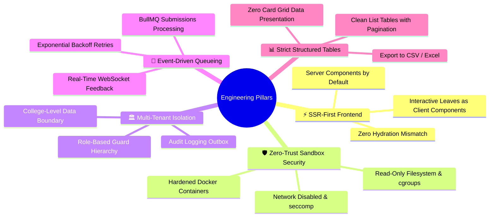
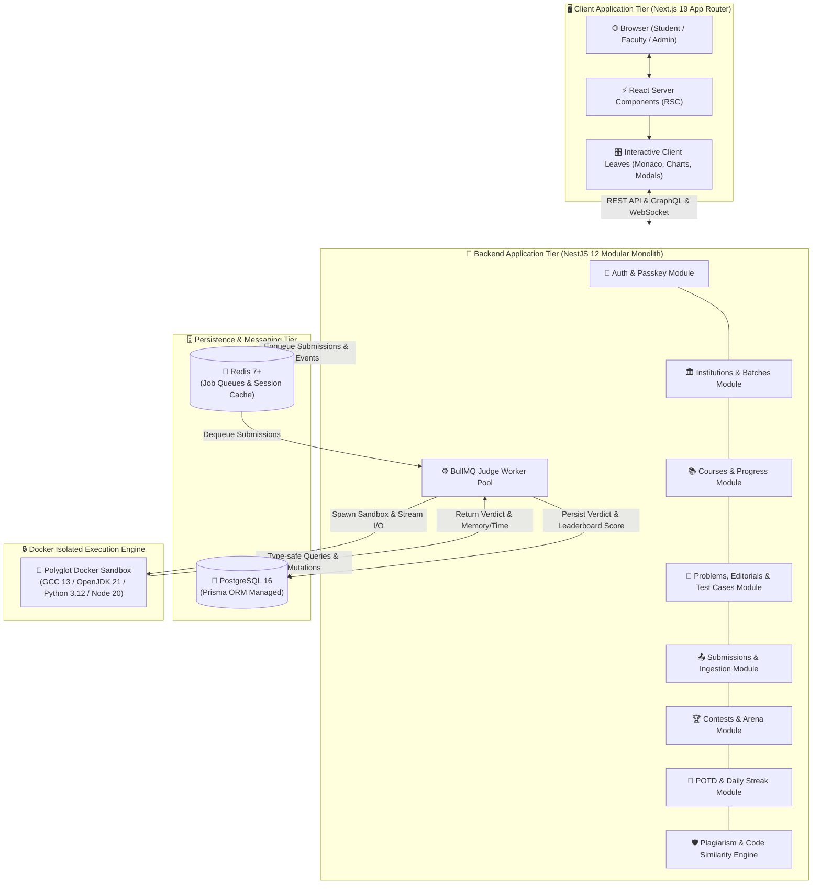
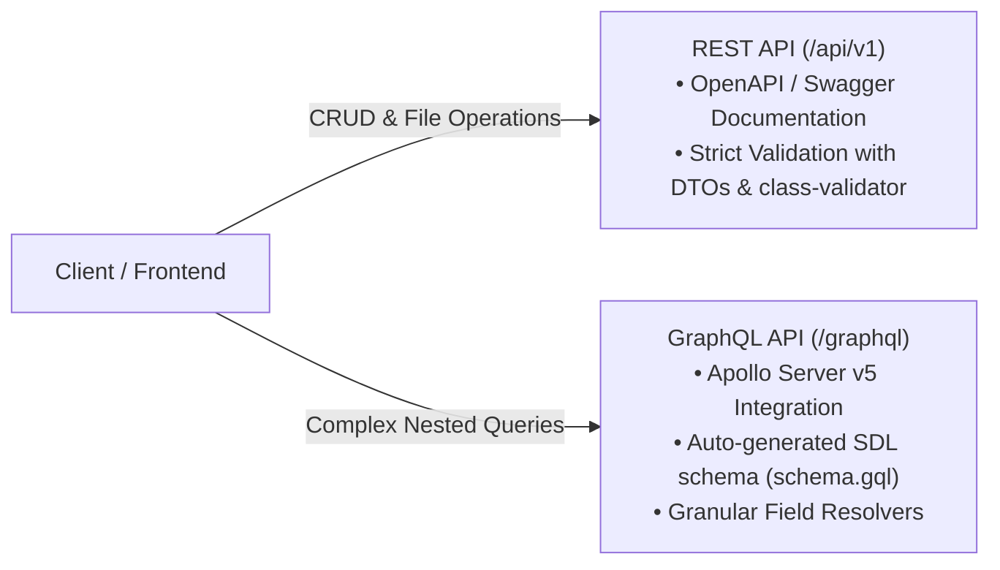
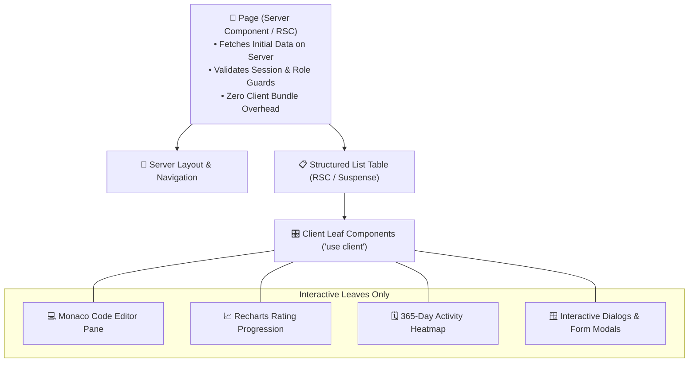
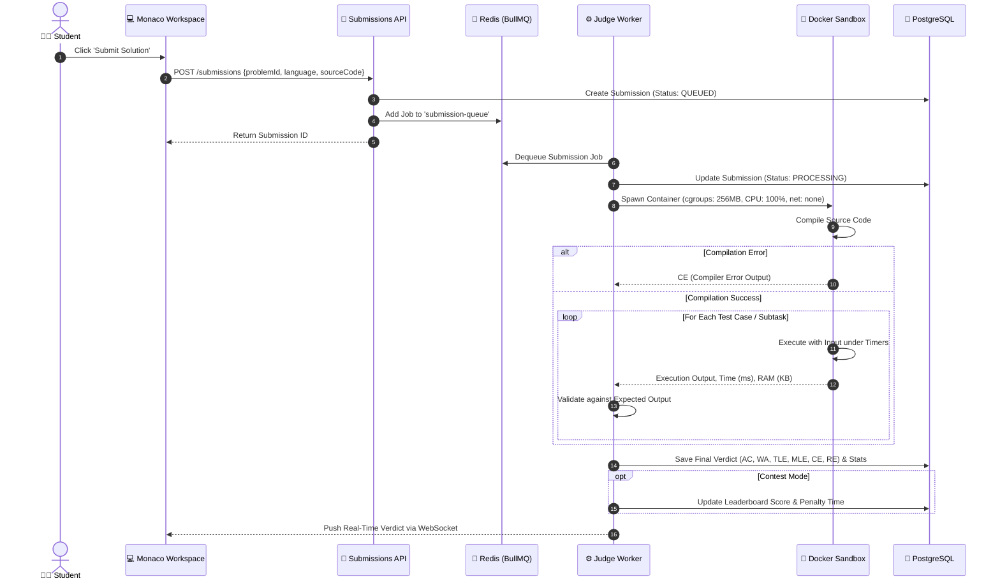
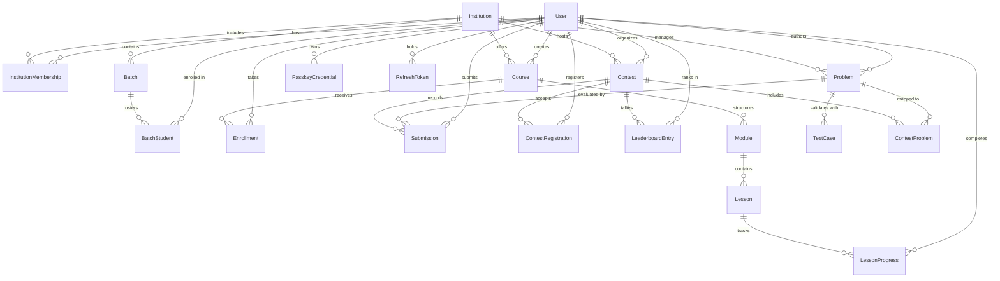
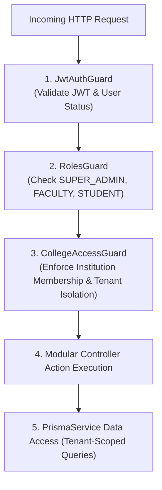

# 🏗️ CodePlatform — System Architecture & Technical Blueprint

> **Document Version**: `1.2.0`  
> **Status**: Production Architecture Baseline  
> **Stack**: NestJS 12 · Next.js 19 (React 19) · PostgreSQL · Prisma 6 · Redis · BullMQ · Docker Sandbox  

---

## 🧭 1. Architectural Philosophy & Principles

CodePlatform is architected around five fundamental engineering pillars:



---

## 🏛️ 2. High-Level System Architecture (C4 Level 1 & 2)



---

## ⚙️ 3. Backend Architecture (`/server`)

The backend is built as a modular, extensible, and type-safe NestJS application located in [`server/src/`](../server/src/).

### 3.1 Backend Module Breakdown

| Module | Directory | Key Controllers & Services | Responsibilities |
| :--- | :--- | :--- | :--- |
| **Auth** | [`server/src/auth/`](../server/src/auth/) | `AuthController`, `AuthService`, `PasskeyService`, `TwoFactorService` | JWT authentication, refresh token family rotation, WebAuthn passkey registration/assertion, TOTP 2FA setup. |
| **Institutions** | [`server/src/institutions/`](../server/src/institutions/) | `InstitutionsController`, `InstitutionsService` | Multi-tenant institution CRUD, tier management, student capacity quotas, membership role binding. |
| **Batches** | [`server/src/batches/`](../server/src/batches/) | `BatchesController`, `BatchesService` | Student cohort creation, batch rosters, bulk CSV invitation ingestion, student roll numbers. |
| **Courses** | [`server/src/courses/`](../server/src/courses/) | `CoursesController`, `CoursesService`, `ModulesService` | Course catalog, hierarchical modules, markdown lessons, student enrollment, and granular progress tracking. |
| **Problems** | [`server/src/problems/`](../server/src/problems/) | `ProblemsController`, `ProblemsService` | Problem authoring, markdown statements, numerical ratings, public/hidden test case storage, subtask allocations. |
| **Submissions** | [`server/src/submissions/`](../server/src/submissions/) | `SubmissionsController`, `SubmissionsService` | Code submission intake, validation, BullMQ job creation, submission status history. |
| **Judge** | [`server/src/judge/`](../server/src/judge/) | `JudgeProcessor`, `DockerSandboxService` | BullMQ worker consuming submission jobs, spawning Docker sandboxes, enforcing limits, compiling/executing code, evaluating subtask verdicts. |
| **Contests** | [`server/src/contests/`](../server/src/contests/) | `ContestsController`, `ContestsService`, `LeaderboardService` | Competitive programming contests, problem mappings, contest timers, real-time START256 matrix leaderboards. |
| **Users** | [`server/src/users/`](../server/src/users/) | `UsersController`, `UsersService` | User identity management, competitive profile stats, 365-day activity heatmaps, contest rating history. |

---

### 3.2 Dual API Strategy: REST & GraphQL



---

## 🖥️ 4. Frontend Architecture (`/client`)

The frontend is built on **Next.js 19 App Router** utilizing an **SSR-First (Server-Side Rendering)** architecture to maximize performance, SEO, and developer ergonomics.

### 4.1 Rendering & Component Boundaries



### 4.2 Frontend Directory Structure

```text
client/src/
├── app/                          # Next.js App Router route hierarchy
│   ├── (auth)/                   # Login, Register, Accept Invitation
│   ├── problems/                 # Problem Archive & Problem Solver Workspace
│   ├── courses/                  # Course Catalog, Modules & Lesson Viewer
│   ├── contests/                 # Contest Arena & START256 Leaderboard
│   ├── students/                 # Student Portfolio, Ratings & Heatmap
│   ├── faculty/                  # Faculty Authoring & Grading Portal
│   ├── institution-admin/        # Batch Rosters & Quota Management
│   └── superadmin/               # Platform Governance & System Telemetry
├── components/                   # Reusable UI & Domain Components
│   ├── shared/                   # StarRatingBadge, Navigation, Breadcrumbs
│   ├── tables/                   # Standardized List Table Components
│   ├── problems/                 # Monaco Editor, Split-Pane Runner, Subtasks
│   └── students/                 # Rating charts, activity heatmaps
├── context/                      # React Context providers (Auth, Theme)
├── lib/                          # Centralized Typed API Client
├── store/                        # Redux Toolkit Global State Store
└── types/                        # Shared TypeScript Interface Definitions
```

---

## 🔒 5. Polyglot Sandboxed Judge Architecture



### 5.1 Sandbox Isolation Specifications

- **Resource Limits (Linux cgroups)**:
  - Max Memory: $256\text{ MB} - 512\text{ MB}$ (Hard limit via `--memory` and `--memory-swap`).
  - Max CPU Quota: $100\%$ of single core (`--cpus="1.0"`).
  - Process Limit: Max 32 spawned processes (`--pids-limit 32`) preventing fork bombs.
- **Filesystem Security**:
  - Root filesystem mounted strictly **Read-Only** (`--read-only`).
  - Temporary workspace mounted via ephemeral `tmpfs` (`/tmp:rw,noexec,nosuid,size=64m`).
- **Network Isolation**: Strict `--network none` preventing socket connection attempts, exfiltration, or LAN scanning.
- **Syscall Filtering**: `seccomp` profile barring unauthorized kernel calls (`ptrace`, `chroot`, `syslog`, `reboot`).

---

## 🗄️ 6. Relational Entity-Relationship (ER) Model



---

## 🛡️ 7. Multi-Tenant Security & Isolation Model



### 7.1 Security Invariants
1. **Never leak password hashes**: Excluded globally via class-transformer interceptors and Prisma select projections.
2. **Protect hidden test cases**: Student queries cannot view `TestCase` where `isHidden: true`.
3. **Outbox invitation encryption**: Activation hashes and invitation URLs are cryptographically protected.
4. **Isolated execution**: No submitted source code is ever evaluated within the host API process.
