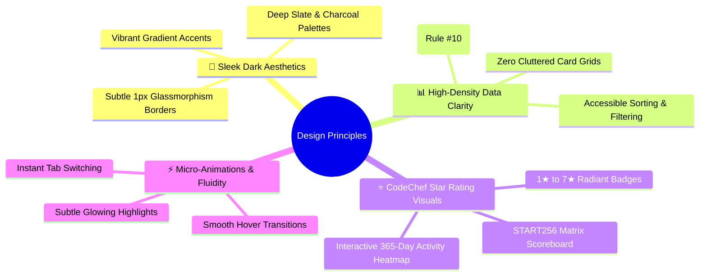

# 🎨 CodePlatform — Design System & UI/UX Guidelines

> **Document Version**: `1.2.0`  
> **Status**: Approved UI/UX Design System  
> **Aesthetic Philosophy**: Modern Developer Aesthetics · Sleek Dark Themes · Glassmorphism · CodeChef Parity · Strict Table Data Standard  

---

## 🌌 1. Core Visual Principles & Aesthetic Foundations

CodePlatform is designed to offer a state-of-the-art, high-density, developer-focused user experience that combines high aesthetic elegance with utilitarian data clarity.



---

## 🎨 2. Color System & Design Tokens

### 2.1 Base Surface & Theme Colors

| Token Name | Hex Code | Purpose / Application |
| :--- | :--- | :--- |
| `--bg-canvas` | `#0b0f19` | Main application background (deep interstellar slate) |
| `--bg-surface` | `#111827` | Primary surface for tables, sidebar, and panels |
| `--bg-card` | `rgba(17, 24, 39, 0.75)` | Glassmorphism cards with backdrop blur ($12\text{px}$) |
| `--border-subtle` | `rgba(255, 255, 255, 0.08)` | 1px clean separation borders |
| `--border-focus` | `#38bdf8` | Vibrant cyan border for active inputs and focused elements |
| `--text-primary` | `#f8fafc` | High-contrast headers, problem titles, and active text |
| `--text-secondary` | `#94a3b8` | Subtitles, metadata, timestamps, and column labels |
| `--text-muted` | `#64748b` | Disabled items, placeholder text, and subtle hints |

---

### 2.2 CodeChef Star Rating & Division Color Tokens

The platform implements strict CodeChef visual parity for competitive ratings:

| Tier | Star Glyph | Rating Range | Primary Color | Hex Code | Glowing CSS Shadow |
| :--- | :---: | :---: | :--- | :--- | :--- |
| **Beginner** | `1★` | $0 - 1399$ | Slate Gray | `#94a3b8` | `0 0 10px rgba(148, 163, 184, 0.3)` |
| **Novice** | `2★` | $1400 - 1599$ | Emerald Green | `#22c55e` | `0 0 12px rgba(34, 197, 94, 0.4)` |
| **Intermediate**| `3★` | $1600 - 1799$ | Cyan Blue | `#06b6d4` | `0 0 12px rgba(6, 182, 212, 0.4)` |
| **Advanced** | `4★` | $1800 - 1999$ | Royal Purple | `#a855f7` | `0 0 12px rgba(168, 85, 247, 0.4)` |
| **Expert** | `5★` | $2000 - 2199$ | Amber Yellow | `#eab308` | `0 0 14px rgba(234, 179, 8, 0.5)` |
| **Master** | `6★` | $2200 - 2499$ | Flame Orange | `#f97316` | `0 0 14px rgba(249, 115, 22, 0.5)` |
| **Grandmaster** | `7★` | $2500 - \infty$ | Crimson Red | `#ef4444` | `0 0 16px rgba(239, 68, 68, 0.6)` |

---

### 2.3 Verdict & Execution Status Color Codes

| Verdict Key | Label | Badge Background | Text Color | Icon |
| :--- | :--- | :--- | :--- | :---: |
| `ACCEPTED` | **Accepted (AC)** | `rgba(34, 197, 94, 0.15)` | `#22c55e` | ✅ |
| `WRONG_ANSWER` | **Wrong Answer (WA)** | `rgba(239, 68, 68, 0.15)` | `#ef4444` | ❌ |
| `TIME_LIMIT_EXCEEDED` | **Time Limit (TLE)** | `rgba(245, 158, 11, 0.15)` | `#f59e0b` | ⏱️ |
| `MEMORY_LIMIT_EXCEEDED`| **Memory Limit (MLE)** | `rgba(249, 115, 22, 0.15)` | `#f97316` | 💾 |
| `COMPILATION_ERROR` | **Compile Error (CE)** | `rgba(217, 70, 239, 0.15)` | `#d946ef` | 🛠️ |
| `RUNTIME_ERROR` | **Runtime Error (RE)** | `rgba(236, 72, 153, 0.15)` | `#ec4899` | ⚠️ |
| `PROCESSING` / `QUEUED`| **Evaluating...** | `rgba(56, 189, 248, 0.15)` | `#38bdf8` | 🔄 |

---

## 🔤 3. Typography & Font Hierarchy

The platform relies on Google Fonts with strict monospace integration for code blocks:
- **Primary Body & Display**: `Inter, system-ui, -apple-system, sans-serif`
- **Monospace & Code Workspace**: `JetBrains Mono, Fira Code, 'Courier New', monospace`

```css
/* Typography Scale */
.text-hero    { font-size: 2.5rem;   line-height: 1.2; font-weight: 800; letter-spacing: -0.025em; }
.text-h1      { font-size: 1.875rem; line-height: 1.25; font-weight: 700; letter-spacing: -0.02em; }
.text-h2      { font-size: 1.5rem;   line-height: 1.3; font-weight: 600; }
.text-h3      { font-size: 1.25rem;  line-height: 1.4; font-weight: 600; }
.text-body    { font-size: 0.875rem; line-height: 1.5; font-weight: 400; }
.text-caption { font-size: 0.75rem;  line-height: 1.4; font-weight: 500; }
.font-mono    { font-family: 'JetBrains Mono', monospace; font-feature-settings: "liga" 1; }
```

---

## 🧩 4. Component Design Specifications

### 4.1 Star Rating Badge (`StarRatingBadge.tsx`)

A reusable badge component rendering the user's star tier, division qualification, and rating range.

```tsx
<StarRatingBadge 
  rating={1845} 
  tier="Advanced" 
  stars={4} 
  division="Div 2" 
  showStars={true} 
  showDivision={true} 
  size="md" 
/>
```
- **Visual Design**: Sleek rounded pill (`rounded-full`), $1\text{px}$ subtle colored border matching tier, gradient fill, and hover tooltip indicating rating boundary.

---

### 4.2 Problem Archive Table (Strict Rule #10 Implementation)

```text
┌────────────────────────────────────────────────────────────────────────────────────────────────────────────────┐
│  🔍 Search problem name / code...   [Difficulty ▾]  [Contest Tag ▾]  [Status ▾]          [📥 Export CSV/Excel]  │
├────────┬────────────┬──────────────────────────────┬──────────────┬──────────┬─────────────┬──────────┬────────┤
│ Status │ Code       │ Problem Title                │ Contest Tag  │ Rating   │ Submissions │ Accuracy │ Action │
├────────┼────────────┼──────────────────────────────┼──────────────┼──────────┼─────────────┼──────────┼────────┤
│   ✅   │ START256_A │ Chef and String Minimization │ START256     │ 480 (1★) │ 14,230      │ 78.4%    │ [Solve]│
│   ⏳   │ START256_B │ Tree Path Inversion          │ START256     │ 1420(2★) │ 6,810       │ 42.1%    │ [Solve]│
│   ❌   │ START256_C │ Graph Modular Eulerian Cycles│ START256     │ 2240(6★) │ 940         │ 18.2%    │ [Solve]│
├────────┴────────────┴──────────────────────────────┴──────────────┴──────────┴─────────────┴──────────┴────────┤
│  Showing 1–10 of 245 problems                                      [⏮ Prev]  Page 1 of 25  [Next ⏭]           │
└────────────────────────────────────────────────────────────────────────────────────────────────────────────────┘
```

#### Table Mandatory Features:
1. **Header Toolbar**: Real-time debounced search bar + multi-select dropdown filters + CSV Export CTA button.
2. **Column Sorting**: Sortable headers with ascending/descending arrow indicators.
3. **Accuracy Bar**: Visual miniature progress indicator showing percentage of successful verdicts.
4. **Interactive Rows**: Subtle hover highlight (`hover:bg-slate-800/50`) and direct action CTA link.

---

### 4.3 START256 Matrix Contest Leaderboard

```text
┌────────────────────────────────────────────────────────────────────────────────────────────────────────┐
│  🏆 START256 Rated Contest — Division 2 Standings                       [Search Competitor...] [Export]│
├──────┬─────────────────────────┬────────┬─────────┬─────────┬─────────┬─────────┬─────────┬────────────┤
│ Rank │ Competitor (College)    │ Rating │ Score   │ Penalty │ P1      │ P2      │ P3      │ P4         │
├──────┼─────────────────────────┼────────┼─────────┼─────────┼─────────┼─────────┼─────────┼────────────┤
│  1   │ 🧑‍🎓 alex_dev (MIT CSE)  │ 1740 3★│ 400 pts │ 01:24   │ 0:12 ✅ │ 0:28 ✅ │ 0:45 (+1)│ 1:24 ✅    │
│  2   │ 🧑‍🎓 priya_k (IIT Delhi) │ 1680 3★│ 300 pts │ 00:58   │ 0:08 ✅ │ 0:19 ✅ │ 0:58 ✅ │ --         │
│  3   │ 🧑‍🎓 mark_99 (Stanford)  │ 1715 3★│ 300 pts │ 01:12   │ 0:15 (+2)│ 0:34 ✅ │ 1:12 ✅ │ --         │
├──────┴─────────────────────────┴────────┴─────────┴─────────┴─────────┴─────────┴─────────┴────────────┤
│  Showing 1–25 of 1,200 participants                                [⏮ Prev]  Page 1 of 48  [Next ⏭]    │
└────────────────────────────────────────────────────────────────────────────────────────────────────────┘
```

- **Matrix Score Pills**:
  - Green Pill: Problem solved (`Solve Time` + optional penalty count `+1`, `+2`).
  - Gray Dash (`--`): Unattempted problem.
  - Red Pill (`-3`): Attempted with 3 incorrect submissions, unsolved.

---

### 4.4 Problem Solving Workspace Layout

```text
┌────────────────────────────────────────────────────────────────────────────────────────────────────────┐
│  [← Back to Problemset]  [PROB-042] Two Sum · Medium  [1420 2★]            [AI Copilot] [Bookmark] [Share]│
├────────────────────────────────────────────────────┬───────────────────────────────────────────────────┤
│  [Description] [Subtasks] [Submissions] [Editorial]│  Language: [ Python 3.12 ▾ ]  ⚙️  [Reset] [Expand] │
├────────────────────────────────────────────────────┼───────────────────────────────────────────────────┤
│  ### Problem Statement                             │  1  def solve(nums: list[int], target: int):      │
│  Given an array of integers nums and an integer    │  2      lookup = {}                               │
│  target, return indices of the two numbers such    │  3      for idx, num in enumerate(nums):          │
│  that they add up to target.                       │  4          diff = target - num                   │
│                                                    │  5          if diff in lookup:                    │
│  ### Constraints                                   │  6              return [lookup[diff], idx]        │
│  • 2 <= nums.length <= 10^5                        │  7          lookup[num] = idx                     │
│  • -10^9 <= nums[i] <= 10^9                        │                                                   │
├────────────────────────────────────────────────────┼───────────────────────────────────────────────────┤
│  Sample Test Cases: [Case 1] [Case 2] [+]          │  Console: [Sample Output] [Raw Stdout]            │
│  Input: [2, 7, 11, 15], target = 9                 │  Verdict: [ ACCEPTED ✅ (0.04s, 14.2MB) ]         │
│  Output: [0, 1]                                    │  [ Run Sample Cases ▶ ]   [ Submit Solution 🚀 ]  │
└────────────────────────────────────────────────────┴───────────────────────────────────────────────────┘
```

- **Split Workspace Options**:
  - **Split View (Default)**: 45% Statement / Subtasks Tabs, 55% Monaco Code Editor & Test Console.
  - **Wide IDE Mode**: 30% Statement, 70% Code Editor.
  - **Focus Mode**: 100% Code Editor with a "Show Problem Description" button to restore split mode.
  - **AI Copilot Drawer**: Right-anchored sliding assistant drawer with step-by-step hints and complexity estimation.

---

### 4.5 Problem of the Day (POTD) & Daily Streak Banner

```text
┌────────────────────────────────────────────────────────────────────────────────────────┐
│  📅 PROBLEM OF THE DAY — 20 SEP 2026                 🔥 14-Day Streak  |  🪙 450 Coins │
├────────────────────────────────────────────────────────────────────────────────────────┤
│  ⚡ [START256_B] Subarray XOR Minimum Equality      [Rating: 1420 2★]  [Solve +50 pts] │
│  "Given an array A of N integers, find the count of non-empty subarrays whose XOR..."  │
├────────────────────────────────────────────────────────────────────────────────────────┤
│  [⏮ Yesterday: Solved ✅]        [Solve Today's Challenge 🚀]        [View Calendar 🗓️] │
└────────────────────────────────────────────────────────────────────────────────────────┘
```

---

### 4.6 Detailed Test Case Execution Matrix ($T_1 \dots T_N$)

```text
┌────────────────────────────────────────────────────────────────────────────────────────┐
│  🧪 Execution Verdict: ACCEPTED (100/100 pts)                       ⏱️ 0.18s  |  💾 14.2MB│
├────────────────────────────────────────────────────────────────────────────────────────┤
│  Subtask 1: [1 ≤ N ≤ 100] (30 pts) — PASSED ✅                                         │
│  [ T1: 0.02s 4MB ✅ ] [ T2: 0.03s 4MB ✅ ] [ T3: 0.02s 5MB ✅ ] [ T4: 0.04s 4MB ✅ ]   │
├────────────────────────────────────────────────────────────────────────────────────────┤
│  Subtask 2: [1 ≤ N ≤ 10^5] (70 pts) — PASSED ✅                                        │
│  [ T5: 0.12s 14MB ✅] [ T6: 0.15s 14MB ✅] [ T7: 0.18s 14MB ✅] [ T8: 0.14s 13MB ✅]  │
└────────────────────────────────────────────────────────────────────────────────────────┘
```

---

### 4.7 Inter-College Standing Table (Rule #10 Standard)

```text
┌────────────────────────────────────────────────────────────────────────────────────────┐
│  🏛️ National Inter-College Rankings                          [Search Institution...]   │
├──────┬──────────────────────────────────┬──────────────┬──────────────┬────────────────┤
│ Rank │ Institution Name                 │ Active Coders│ Top 10% Avg  │ Total Solves   │
├──────┼──────────────────────────────────┼──────────────┼──────────────┼────────────────┤
│  1   │ Indian Institute of Technology D.│ 1,420        │ 2410 (6★)    │ 48,920         │
│  2   │ BITS Pilani                      │ 1,180        │ 2320 (6★)    │ 39,410         │
│  3   │ National Institute of Technology │ 950          │ 2180 (5★)    │ 31,200         │
├──────┴──────────────────────────────────┴──────────────┴──────────────┴────────────────┤
│  Showing 1–10 of 180 Institutions                                   Page 1 of 18       │
└────────────────────────────────────────────────────────────────────────────────────────┘
```

---

### 4.8 Profile Achievements & Badges

```text
┌────────────────────────────────────────────────────────────────────────────────────────┐
│  🎖️ Competitive Achievements & Badges                                                  │
├────────────────────────────────────────────────────────────────────────────────────────┤
│  [ 🏆 Contest Crusader (25+ Contests) ]   [ 🔥 Streak Master (30-day POTD) ]          │
│  [ ⚡ Speed Demon (AC in < 5 mins)   ]   [ 🌟 Div 1 Contender (Rating ≥ 2000) ]       │
│  [ 🦉 Night Owl (AC at 2:00 AM)      ]   [ 🎯 Flawless AC (100% First Attempt) ]      │
└────────────────────────────────────────────────────────────────────────────────────────┘
```

---

## 📱 5. Responsive Breakpoints & Device Adaptability

| Breakpoint | Minimum Width | Primary Target Devices | UI Adaptation Behavior |
| :--- | :--- | :--- | :--- |
| `sm` | $640\text{px}$ | Mobile (Landscape) | Stacked single-column layouts; tables scroll horizontally. |
| `md` | $768\text{px}$ | Tablets & iPads | Collapsible sidebar navigation drawer; 2-column form grids. |
| `lg` | $1024\text{px}$ | Laptops & Small Desktops | Fixed sidebar; Split-pane problem solver layout activated. |
| `xl` | $1280\text{px}$ | Standard Desktop Displays | Expanded table columns, rich charts, and full matrix scoreboard. |
| `2xl` | $1536\text{px}$ | Ultra-wide Displays | Container max-width constrained with centered margin alignment. |

---

## ♿ 6. Accessibility & Usability Standards (WCAG 2.1 AA)

- 👁️ **Contrast Ratios**: All text tokens maintain minimum $4.5:1$ contrast ratio against background surfaces.
- ⌨️ **Keyboard Navigation**: Complete focus ring visibility (`focus-visible:ring-2 focus-visible:ring-sky-400`), skip-to-content anchors, and keyboard-accessible modal dialogs.
- 🏷️ **ARIA Labels**: All interactive icon buttons (`IconButton`), tabs, and status badges include explicit `aria-label` attributes.
- 🚫 **Reduced Motion**: Respects `prefers-reduced-motion` media query to suppress animations for sensitive users.
