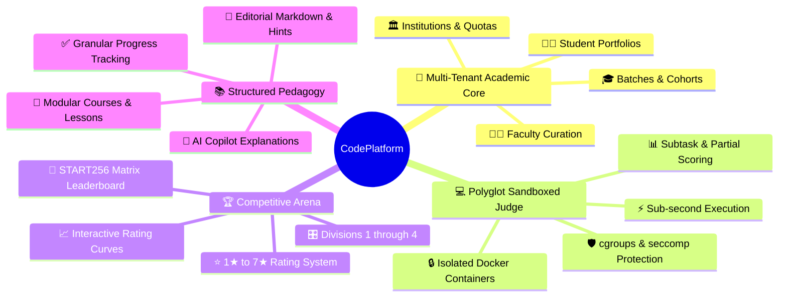
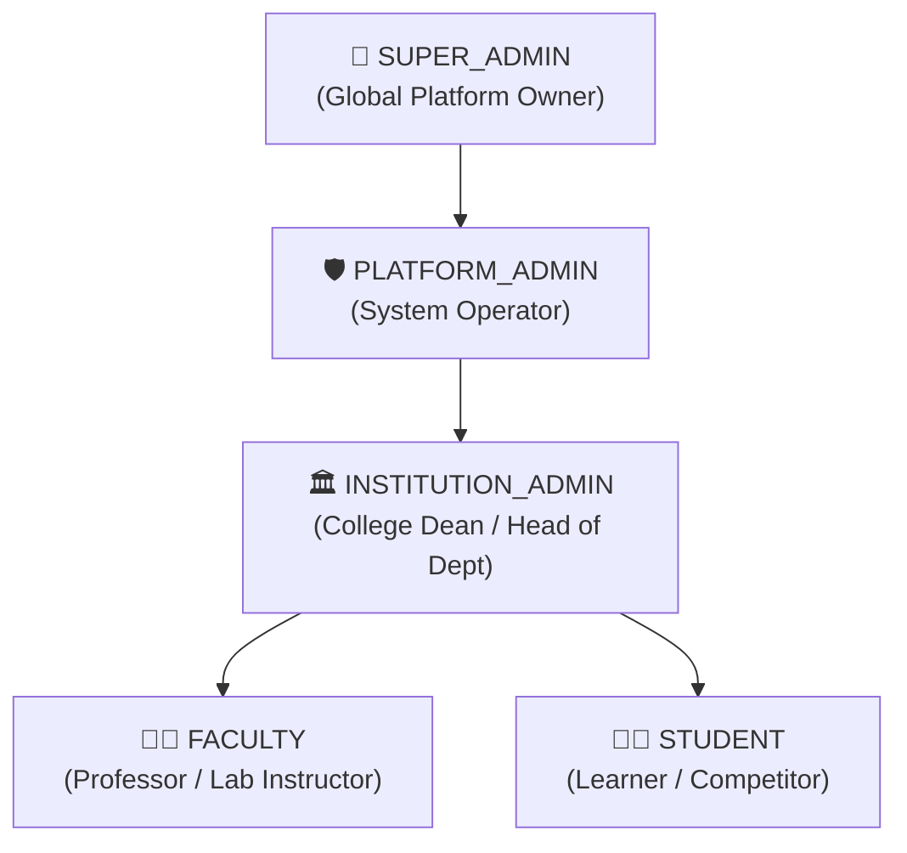
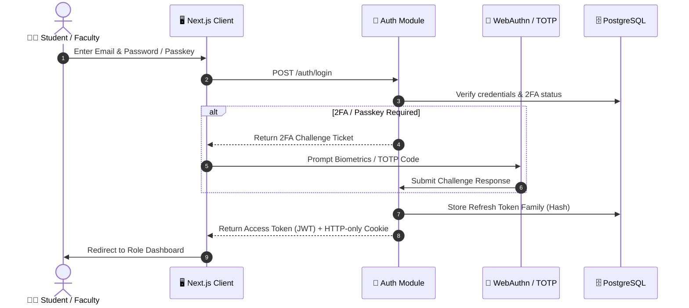
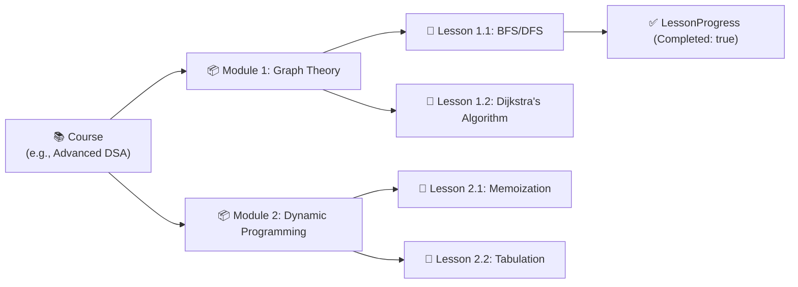
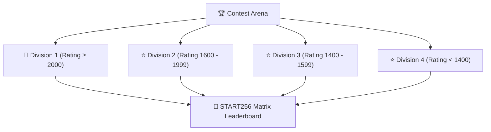
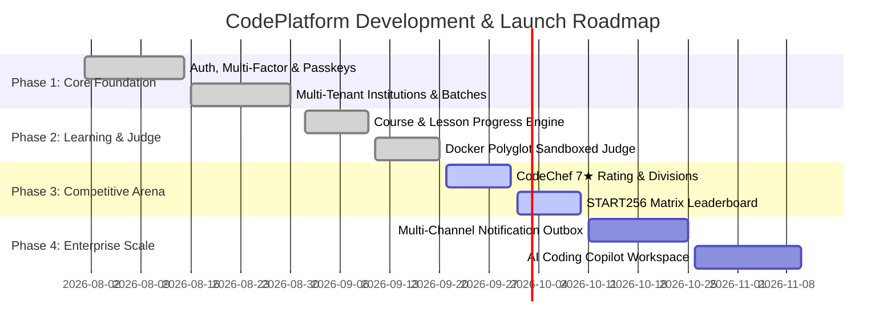

# 📋 CodePlatform — Product Requirements Document (PRD)

> **Document Version**: `1.2.0`  
> **Target Audience**: Product Managers, Engineering Leads, Architects, Designers, QA  
> **Platform Classification**: Enterprise Multi-Tenant EdTech & Sandboxed Competitive Programming Platform  

---

## 📌 1. Executive Summary & Vision

**CodePlatform** is an enterprise-grade, full-stack learning and competitive programming ecosystem tailored for universities, technical colleges, faculty members, and students. Combining the structured pedagogical tracking of modern Learning Management Systems (LMS) with the high-stakes, real-time rigor of competitive coding platforms (LeetCode, CodeChef, Codeforces), CodePlatform empowers educational institutions to train, evaluate, and benchmark developer talent at scale.

---

## 🎯 2. Goals & Success Metrics

### 2.1 Strategic Goals
- 🏫 **Institutional Governance**: Enable academic institutions to seamlessly onboard faculty, manage student cohorts (batches), and assess performance within isolated tenants.
- ⚡ **Automated Polyglot Evaluation**: Deliver instant, sub-second verdicts for submissions across C++, Java, Python, C, and JavaScript using hardened Docker sandboxes.
- 🌟 **Competitive Parity**: Provide a tier-based rating engine (1★ to 7★), division-based contest matchmaking, and real-time matrix leaderboards.
- 📈 **Student Outcome Acceleration**: Deliver deep pedagogical insights, streak heatmaps, and AI-powered coding hints to accelerate student learning.

### 2.2 Key Performance Indicators (KPIs)

| Metric Category | Target SLA / KPI | Verification Method |
| :--- | :--- | :--- |
| **Judge Latency** | $\le 1.5\text{s}$ per single test case; $\le 12\text{s}$ batch suite | BullMQ metric counters & Redis timestamps |
| **System Availability** | $99.9\%$ uptime for contest arena | Cloud health probes & Application Insights |
| **Concurrent Submissions** | $1,000+$ simultaneous executions | KEDA auto-scaling worker nodes |
| **Data Isolation** | $100\%$ tenant isolation between institutions | Automated multi-tenant integration test suite |
| **SSR First Contentful Paint** | $< 0.8\text{s}$ on modern broadband | Lighthouse CI audits & Web Vitals tracker |

---

## 👥 3. User Personas & Role Hierarchy

### 3.1 Role Capabilities Matrix

| Feature / Domain | 👑 Super Admin | 🛡️ Platform Admin | 🏛️ Institution Admin | 👨‍🏫 Faculty | 🧑‍🎓 Student |
| :--- | :---: | :---: | :---: | :---: | :---: |
| **Platform-Wide Analytics** | ✅ Full | ✅ Full | ❌ Restricted | ❌ Restricted | ❌ Restricted |
| **Create & Manage Institutions** | ✅ Full | ✅ Full | ❌ Restricted | ❌ Restricted | ❌ Restricted |
| **Manage Institution Quotas & Tiers** | ✅ Full | ✅ Full | 👁️ Read-Only | ❌ Restricted | ❌ Restricted |
| **Batch Roster & Student Invitations** | ✅ Full | ✅ Full | ✅ Full | 👁️ Read-Only | ❌ Restricted |
| **Course & Curriculum Authoring** | ✅ Full | ✅ Full | ✅ Full | ✅ Full | 👁️ Enrolled Only |
| **Problem Curation & Hidden Tests** | ✅ Full | ✅ Full | ✅ Full | ✅ Full | ❌ Hidden Tests Barred |
| **Contest Creation & Scheduling** | ✅ Full | ✅ Full | ✅ Full | ✅ Full | ❌ Restricted |
| **Contest Participation & Arena** | 👁️ Spectate | 👁️ Spectate | 👁️ Spectate | 👁️ Spectate | ✅ Compete |
| **Problem Solving & IDE Workspace** | ✅ Full | ✅ Full | ✅ Full | ✅ Full | ✅ Full |
| **Personal Competitive Profile** | ✅ View | ✅ View | ✅ View | ✅ View | ✅ View & Edit |

---

## 🚀 4. Functional Requirements & Feature Specifications

### 4.1 Authentication & Identity Security

- **🔑 WebAuthn Passkeys**: Support biometric login (Face ID, Touch ID, Windows Hello, YubiKey) via `@simplewebauthn/server`.
- **🛡️ Multi-Factor Authentication (TOTP)**: RFC 6238 time-based one-time password pairing with QR codes and encrypted recovery codes.
- **🔄 Token Family Rotation**: Anti-replay refresh token family invalidation to prevent session hijacking.
- **✉️ Transactional Outbox Invitations**: Token-based student batch invitations delivered via multi-channel notification engine.

---

### 4.2 Multi-Tenant Academic Institutions & Batches

- **🏛️ Institution Isolation**: Multi-tenant data partition enforced via `InstitutionMembership` and `CollegeAccessGuard`.
- **🏷️ Academic Tiers & Quotas**: Configurable student seat limits (e.g., Standard Academic, Premium Enterprise).
- **🎓 Student Batches (Cohorts)**: Grouping students by academic year, division, or specialization (e.g., *CSE-2026-Batch-A*).
- **📋 Roster Management**: Bulk CSV invitation ingestion, roll number tracking, and automated onboarding workflows.

---

### 4.3 Structured Courses & Learning Progression

- **📖 Curricula Architecture**: Hierarchical `Course` $\rightarrow$ `Module` $\rightarrow$ `Lesson` progression with markdown content, video embeds, and embedded code snippets.
- **📊 Granular Progress Tracking**: Real-time student completion percentage, completion timestamps, and certificate eligibility.
- **🔒 Access Controls**: Institutional-only or publicly published courses with draft/archived states.

---

### 4.4 Problem Repository & Sandboxed Judge Execution

- **🧩 LeetCode/CodeChef Style Problems**: Detailed problem statements, input/output formats, constraints, sample test cases with explanations, and numerical difficulty ratings (Easy $\approx 480$, Medium $\approx 1420$, Hard $\approx 2240$).
- **🧪 Hidden Test Suites & Subtasks**: Multi-test subtask weighting (e.g., Subtask 1: $N \le 100$ [30 pts], Subtask 2: $N \le 10^5$ [70 pts]).
- **⚙️ Supported Languages & Limits**:
  - `C++ (GCC 13)`: 1000ms / 256MB
  - `Java 21`: 2000ms / 512MB
  - `Python 3.12`: 3000ms / 256MB
  - `C (GCC 13)`: 1000ms / 256MB
  - `JavaScript (Node.js 20)`: 2000ms / 256MB
- **⚖️ Judge Verdicts**: `ACCEPTED` (AC), `WRONG_ANSWER` (WA), `TIME_LIMIT_EXCEEDED` (TLE), `MEMORY_LIMIT_EXCEEDED` (MLE), `RUNTIME_ERROR` (RE), `COMPILATION_ERROR` (CE), `SYSTEM_ERROR`.

---

### 4.5 Competitive Contests & CodeChef Parity

- **⭐ 7-Tier Star Rating Engine**:
  - `1★ Beginner` ($0 - 1399$)
  - `2★ Novice` ($1400 - 1599$)
  - `3★ Intermediate` ($1600 - 1799$)
  - `4★ Advanced` ($1800 - 1999$)
  - `5★ Expert` ($2000 - 2199$)
  - `6★ Master` ($2200 - 2499$)
  - `7★ Grandmaster` ($2500 - \infty$)
- **🏁 START256 Matrix Leaderboard**: Problem columns (`P1`, `P2`, `P3...`), solve time indicators (`0:14`), penalty counts (`+1`, `+2`), and pagination offset ranking formulas.
- **📈 Interactive Rating Curves & 365-Day Activity Heatmaps**: Real-time student portfolio showcasing contest trajectories and daily problem-solving streaks.
- **📅 Problem of the Day (POTD) & Streaks**: Deterministic global daily algorithmic challenge with streak multiplier ($1.0\times - 1.6\times$), coin rewards, and calendar badge stamps.
- **🧪 Detailed Test Case Execution Matrix**: Per-test case execution breakdown ($T_1, T_2, \dots, T_{20}$) displaying granular status, execution time (ms), and memory (KB).
- **📝 Official Problem Editorials & $\LaTeX$ Proofs**: Multi-approach solutions ($O(N^2) \rightarrow O(N \log N)$), mathematical formulas, and official reference code in C++, Java, and Python.
- **🏛️ Inter-College & Batch-vs-Batch Comparison**: College rankings based on average rating of top 10% active competitive programmers, and faculty comparative analytics between student batches.
- **🎖️ Gamified Profile Badges & Achievements**: Unlockable achievements (e.g., *Contest Crusader*, *Streak Master*, *Night Owl*, *Div 1 Crusher*).
- **🛡️ Automated Plagiarism & Code Similarity Detection**: AST token-based similarity analysis across contest submissions to flag cheating and protect leaderboard integrity.

---

## 📊 5. Data Presentation & UI Governance (Rule #10)

> [!IMPORTANT]
> **Strict Standard**: All collections, records, and multi-item datasets across the platform MUST be presented in a clean, accessible **List Table Format only**. Card grids for datasets are strictly prohibited.

### 5.1 Mandatory Table Features
- 🔍 **Real-Time Search & Debounced Filter Bar** (by title, code, tag, status, role, or date).
- 🏷️ **Multi-Select Dropdown Filters** (Difficulty, Star Rating, Division, Institution).
- 📄 **Server-Side & Client Pagination** with configurable rows-per-page ($10, 25, 50, 100$).
- 📥 **Export Capabilities**: Clean CSV / Excel export for academic audit and grading reports.
- ⚡ **Accessibility & Responsiveness**: Keyboard navigable, sticky header rows, and horizontal scrolling for mobile devices.

---

## 🛡️ 6. Non-Functional Requirements (NFRs)

| Domain | Specification | Enforcement Mechanism |
| :--- | :--- | :--- |
| **🔒 Security** | Zero plain-text passwords, zero hidden test leaks, AES-256 encrypted TOTP keys | Prisma middleware, Bcrypt (12 rounds), Security unit tests |
| **⚡ Performance** | Server-Side Rendering (SSR) by default; client components strictly for interactive leaves | Next.js 19 App Router & React Server Components |
| **📦 Sandbox Isolation** | Read-only container root, `--network none`, cgroups memory/cpu limit, unprivileged user | Docker Engine API & Linux security profiles |
| **🌐 Reliability** | Redis BullMQ retry policies, exponential backoff, dead-letter queues | BullMQ automatic job retry & recovery hooks |
| **📱 Cross-Platform** | Fully responsive across Desktop ($1920\text{px}$), Laptop ($1366\text{px}$), and Mobile ($375\text{px}$) | Tailwind CSS responsive utility classes & MUI v9 |

---

## 📅 7. Release Milestones & Phase Map

