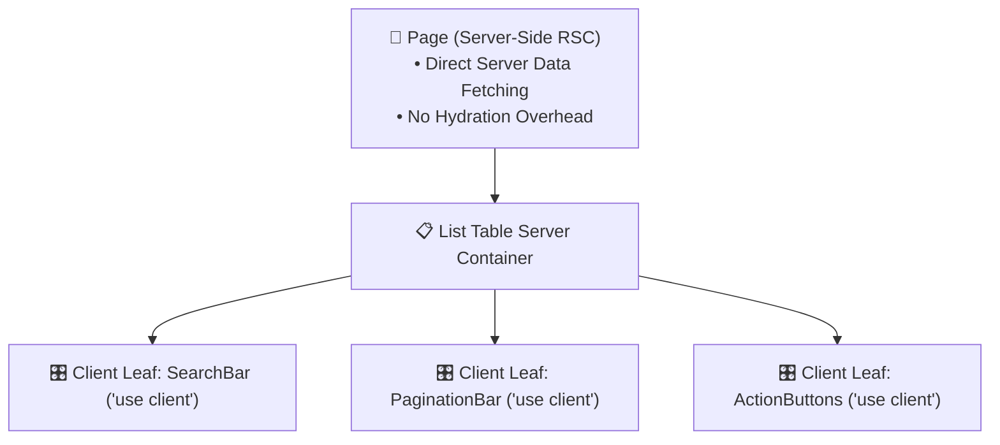

# 📜 CodePlatform — Engineering Rules & Operational Standards

> **Document Version**: `1.2.0`  
> **Status**: Mandatory Invariants & Architectural Rules  
> **Enforcement**: Strictly enforced across all PRs, AI Agent workflows, and developer contributions  

---

## 🎯 1. Core Engineering Rules & Compliance Matrix

| Rule ID | Rule Name | Category | Enforcement Level | Verification Tool |
| :---: | :--- | :--- | :---: | :--- |
| **R-01** | **Inspect Before Modifying** | Architecture | 🔴 Critical | Pre-commit inspection & file diff review |
| **R-02** | **Modular & Thin Layers** | Architecture | 🟡 High | Code review & NestJS module boundaries |
| **R-03** | **SSR by Default (RSC)** | Frontend | 🔴 Critical | Next.js build analyzer & component audit |
| **R-04** | **Multi-Tenant Isolation** | Security | 🔴 Critical | `CollegeAccessGuard` & multi-tenant tests |
| **R-05** | **Zero-Trust Security** | Security | 🔴 Critical | Prisma select filters & Docker sandboxes |
| **R-06** | **UI Design Excellence** | Frontend | 🟡 High | Design system tokens & UX audit |
| **R-07** | **Strict Input Validation** | Backend | 🔴 Critical | `class-validator` DTOs & ValidationPipe |
| **R-08** | **Database Integrity via Prisma**| Persistence | 🔴 Critical | `PrismaService` & migration integrity |
| **R-09** | **Continuous Verification** | Quality | 🔴 Critical | Vitest, Supertest, Oxlint, `tsc --noEmit` |
| **R-10** | **Strict List Table Data Standard**| UX / Data | 🔴 Critical | UI inspection & dataset table checks |

---

## 🔍 2. Detailed Rule Specifications

### 📌 Rule 1: Inspect Before Modifying (R-01)
- **Principle**: Never guess or assume codebase structure, types, or configuration. Always inspect active code before applying changes.
- **Rules**:
  - Always read existing interfaces, service signatures, and related files before modifying.
  - Verify if shared utility functions or components already exist before authoring new ones.
  - Check database migration history before introducing schema changes.

---

### 📌 Rule 2: Modular Architecture & Separation of Concerns (R-02)
- **Principle**: Keep controllers thin and declarative; encapsulate all business rules and complex logic inside dedicated services.
- **Rules**:
  - **Controllers**: Handle HTTP routing, input validation pipes, status codes, and delegate to services.
  - **Services**: Contain pure business logic, transactional database calls, queue events, and exception throwing.
  - **Frontend Components**: Keep presentation components focused, reusable, and decoupled from raw HTTP calls by using centralized API services (`lib/api.ts`).

---

### 📌 Rule 3: SSR by Default — React Server Components (R-03)
- **Principle**: All Next.js pages and layouts MUST be React Server Components (RSC) by default.
- **Rules**:
  - Perform all initial data-fetching, session validation, and layout assembly on the server.
  - Strictly limit `'use client'` to interactive leaf components (e.g., event handlers, forms, `useState`/`useEffect`, Monaco editor, Recharts).
  - Never wrap entire pages in `'use client'` unless strictly required by client-side browser APIs that cannot be deferred.



---

### 📌 Rule 4: Multi-Tenant Data Isolation (R-04)
- **Principle**: No institution or tenant may ever access, query, or mutate another institution's data.
- **Rules**:
  - Enforce `CollegeAccessGuard` on all institution-scoped API endpoints.
  - In Prisma queries, always scope by `institutionId` derived from the validated JWT token/session, never from unvalidated client parameters.
  - Global roles (`SUPER_ADMIN`, `PLATFORM_ADMIN`) are the only entities permitted cross-tenant inspection.

---

### 📌 Rule 5: Zero-Trust Security & Data Protection (R-05)
- **Principle**: Protect credentials, secret tokens, and problem confidentiality at all costs.
- **Rules**:
  - 🚫 **Zero Password Leaks**: Never select or return `passwordHash` in API responses. Use Prisma exclusion projections.
  - 🚫 **Hidden Test Protection**: Never expose hidden test cases (`isHidden: true`) in student-accessible problem endpoints.
  - 🚫 **No Host Code Execution**: Never compile or execute user-submitted code in the main API Node.js process. Always route to Docker sandboxes with `cgroups`, `seccomp`, and `--network none`.
  - 🔐 **Token Family Rotation**: Invalidate all refresh tokens in a family if token reuse is detected.

---

### 📌 Rule 6: UI & Design Excellence (R-06)
- **Principle**: Interfaces must look modern, developer-friendly, polished, and responsive.
- **Rules**:
  - Maintain the sleek dark aesthetic using curated design tokens (`#0b0f19`, `#111827`).
  - Use subtle glassmorphism borders (`rgba(255, 255, 255, 0.08)`) and backdrop blur.
  - Ensure zero layout breaks across Desktop ($1920\text{px}$), Tablet ($768\text{px}$), and Mobile ($375\text{px}$).

---

### 📌 Rule 7: Strict Input Validation via DTOs (R-07)
- **Principle**: Reject malformed or unauthorized inputs at the network edge before reaching database layers.
- **Rules**:
  - Every backend endpoint must declare a typed DTO class decorated with `class-validator` annotations (`@IsString()`, `@IsEmail()`, `@Min()`, `@Max()`).
  - Enable `ValidationPipe({ whitelist: true, forbidNonWhitelisted: true, transform: true })` globally.
  - Frontend forms must use typed schemas matching backend DTO constraints.

---

### 📌 Rule 8: Database Integrity via Prisma ORM (R-08)
- **Principle**: Maintain relational consistency and type safety across all database interactions.
- **Rules**:
  - Always use `PrismaService` for database operations.
  - Never execute raw SQL strings unless explicitly required for performance optimization, and always use parameterized queries (`prisma.$queryRaw`).
  - Run database migrations systematically with `prisma migrate dev` or `prisma migrate deploy`.

---

### 📌 Rule 9: Continuous Verification & Quality Gates (R-09)
- **Principle**: Never claim a feature, fix, or task is complete without automated verification.
- **Rules**:
  - Run `oxlint` on both backend and frontend to catch code smell and lint violations.
  - Run `pnpm test` (Vitest test suite) to ensure regression safety.
  - Execute `pnpm exec tsc --noEmit` to verify type completeness.

---

### 📌 Rule 10: Strict List Table Data Presentation Standard (R-10)

> [!IMPORTANT]
> **Mandatory Standard**: For viewing multi-item collections, records, and datasets (institutions, problems, submissions, student rosters, courses, contests), strictly use clean, structured **list table format only** (with search, filtering, pagination, and Excel/CSV export) rather than card grid layouts.

```text
✅ ALLOWED: Clean, structured List Tables with sorting, search, filters, pagination, and export.
❌ PROHIBITED: Card grid layouts for dataset exploration and management views.
```

#### Table Feature Checklist:
- [x] **Real-time Search Bar**: Filter by name, code, handle, or email.
- [x] **Dropdown Filters**: Filter by status, difficulty, star tier, or division.
- [x] **Sortable Column Headers**: Clickable headers for ascending/descending ordering.
- [x] **Pagination Controls**: Configurable rows per page ($10, 25, 50, 100$) with current page indicator.
- [x] **Data Export**: Clean CSV / Excel export button for reports and roster audits.

---

## 📋 3. Task Completion Report Standard

Whenever a development task, feature implementation, or phase is concluded, a standardized report must be generated containing:

1. **Summary of Implementation**: High-level overview of accomplishments.
2. **Files Changed**: Complete list of created, modified, or deleted files with markdown links.
3. **Database Changes**: Schema updates, Prisma models, or migrations applied.
4. **API Endpoints / Frontend Routes**: New or updated REST endpoints, GraphQL resolvers, and Next.js routes.
5. **Tests Added / UI Components Built**: Vitest test coverage and reusable UI components created.
6. **Commands Executed**: List of build, migration, test, or lint commands run.
7. **Verification Results**: Test pass rates, linting output, and type checking status.
8. **Remaining Issues / Next Steps**: Known items, edge cases, or pending follow-ups.
