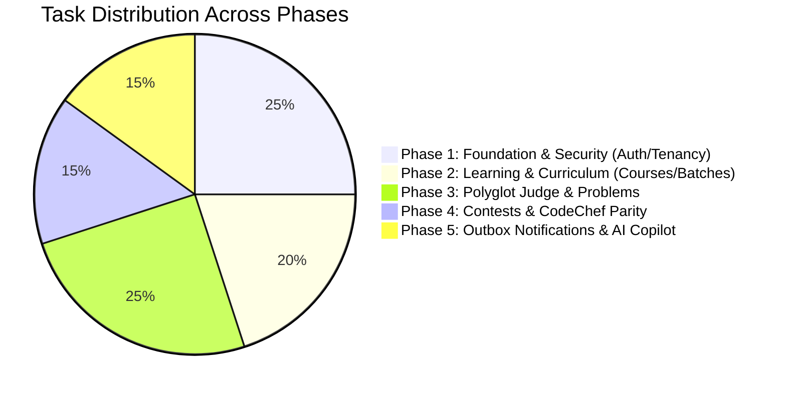

# 📋 CodePlatform — Engineering Tasks & Feature Roadmap

> **Document Version**: `1.2.0`  
> **Status**: Active Sprint & Feature Tracking  
> **Legend**: ✅ Done · 🟡 In Progress · ⏳ Pending · 🔒 Blocked  

---

## 🧭 1. Master Phase Overview

---

## 📊 2. Task Breakdown by Domain

### 🔐 Domain 1: Authentication & Identity Security

| Task ID | Task Title & Description | Priority | Component / Target Files | Status | Acceptance Criteria |
| :---: | :--- | :---: | :--- | :---: | :--- |
| **TSK-AUTH-01** | **JWT Access & Refresh Token Family Rotation** | `P0` | `server/src/auth/` | ✅ Done | Replay detection revokes all tokens in family; returns HTTP-only cookies. |
| **TSK-AUTH-02** | **WebAuthn Passkeys Registration & Assertion** | `P0` | `server/src/auth/passkey.service.ts` | ✅ Done | Biometric login (Touch ID, Windows Hello, YubiKey) supported via SimpleWebAuthn. |
| **TSK-AUTH-03** | **TOTP Multi-Factor Authentication (2FA)** | `P0` | `server/src/auth/two-factor.service.ts` | ✅ Done | RFC 6238 TOTP pairing with QR code generator & encrypted recovery codes. |
| **TSK-AUTH-04** | **Transactional Outbox User Invitations** | `P1` | `server/src/users/` | ✅ Done | AES-256 encrypted invitation tokens with expiration tracking. |
| **TSK-AUTH-05** | **Audit Logging Interceptor** | `P1` | `server/src/common/interceptors/` | ✅ Done | Logs all privileged security events to `audit_logs` table. |

---

### 🏛️ Domain 2: Multi-Tenancy, Institutions & Student Batches

| Task ID | Task Title & Description | Priority | Component / Target Files | Status | Acceptance Criteria |
| :---: | :--- | :---: | :--- | :---: | :--- |
| **TSK-INST-01** | **Institution Multi-Tenant CRUD & Tiers** | `P0` | `server/src/institutions/` | ✅ Done | Institution isolation, code uniqueness, seat quota tier enforcement. |
| **TSK-INST-02** | **CollegeAccessGuard Isolation** | `P0` | `server/src/common/guards/` | ✅ Done | Cross-tenant access blocked; only authorized members access institution data. |
| **TSK-BTCH-01** | **Student Batch (Cohort) Roster Management** | `P0` | `server/src/batches/` | ✅ Done | Batches with capacity limits, start/end dates, and student roll numbers. |
| **TSK-BTCH-02** | **Bulk Student CSV Roster Ingestion** | `P1` | `client/src/components/batches/` | ✅ Done | Ingest CSV list of student emails/roll numbers and trigger outbox invitations. |
| **TSK-INST-03** | **Institution Admin List Tables (Rule #10)** | `P0` | `client/src/app/institution-admin/` | ✅ Done | Clean list table for batches, quotas, and faculty rosters with CSV export. |

---

### 📚 Domain 3: Courses, Modules & Pedagogical Progress

| Task ID | Task Title & Description | Priority | Component / Target Files | Status | Acceptance Criteria |
| :---: | :--- | :---: | :--- | :---: | :--- |
| **TSK-CRSE-01** | **Curriculum Tree (Course $\rightarrow$ Module $\rightarrow$ Lesson)** | `P0` | `server/src/courses/` | ✅ Done | CRUD for courses, structured modules, markdown lessons with order indexes. |
| **TSK-CRSE-02** | **Granular Student Lesson Progress Engine** | `P0` | `server/src/courses/progress.service.ts`| ✅ Done | Per-lesson completion status, overall course progress %, and timestamps. |
| **TSK-CRSE-03** | **Interactive Lesson Viewer & Code Runner** | `P1` | `client/src/app/courses/` | ✅ Done | Split-view lesson content with embedded markdown rendering and practice code pane. |
| **TSK-CRSE-04** | **Course Catalog List Table (Rule #10)** | `P0` | `client/src/components/courses/` | ✅ Done | Structured list table with category filters, difficulty tags, and enroll CTA. |

---

### 🧩 Domain 4: Problemset & Polyglot Sandboxed Judge

| Task ID | Task Title & Description | Priority | Component / Target Files | Status | Acceptance Criteria |
| :---: | :--- | :---: | :--- | :---: | :--- |
| **TSK-PROB-01** | **Problem Repository & Test Case Storage** | `P0` | `server/src/problems/` | ✅ Done | Slug generation, difficulty ratings, time/memory limits, public/hidden tests. |
| **TSK-PROB-02** | **Subtask Allocation & Partial Scoring** | `P1` | `server/src/problems/` | ✅ Done | Multi-test subtask weighting (e.g. Subtask 1: 30 pts, Subtask 2: 70 pts). |
| **TSK-JDG-01** | **BullMQ Submission Ingestion Queue** | `P0` | `server/src/submissions/` | ✅ Done | Asynchronous queuing of submissions with Redis persistence and retry policies. |
| **TSK-JDG-02** | **Docker Sandbox Isolation Engine** | `P0` | `server/src/judge/` | ✅ Done | Hardened container runner (C++, Java, Python, C, JS) with cgroups/seccomp limits. |
| **TSK-JDG-03** | **Verdict Evaluation Engine** | `P0` | `server/src/judge/` | ✅ Done | Precise verdicts: `ACCEPTED`, `WA`, `TLE`, `MLE`, `CE`, `RE` within $\le 1.5\text{s}$ per test. |
| **TSK-PROB-03** | **Monaco Editor Split-Pane Problem Solver** | `P0` | `client/src/components/problems/` | ✅ Done | Split-pane IDE, custom test runner console, subtasks tab, real-time score pills. |
| **TSK-PROB-04** | **Problem Archive List Table (Rule #10)** | `P0` | `client/src/components/problems/` | ✅ Done | Clean list table with search, difficulty filter, star ratings, and solve CTA. |

---

### 🏆 Domain 5: Contests, CodeChef Parity & Leaderboards

| Task ID | Task Title & Description | Priority | Component / Target Files | Status | Acceptance Criteria |
| :---: | :--- | :---: | :--- | :---: | :--- |
| **TSK-CONT-01** | **Contest Lifecycle & Timer Management** | `P0` | `server/src/contests/` | ✅ Done | Scheduled contests (`UPCOMING`, `ONGOING`, `COMPLETED`), registrations. |
| **TSK-CONT-02** | **CodeChef 1★ to 7★ Rating System Engine** | `P0` | `client/src/utils/codechefRating.ts` | ✅ Done | Star tier boundaries (<1400 to 2500+), unbounded 7★ tier, division mapping. |
| **TSK-CONT-03** | **Division-Based Arena Filter Tabs** | `P1` | `client/src/components/contests/` | ✅ Done | Div 1, Div 2, Div 3, Div 4 tabs with automatic page reset on filter switch. |
| **TSK-CONT-04** | **START256 Matrix Contest Leaderboard** | `P0` | `client/src/components/leaderboard/` | ✅ Done | Problem columns (`P1`, `P2...`), solve times (`0:14`), penalties (`+1`), pagination rank. |
| **TSK-USER-01** | **Student Profile Rating History Chart** | `P1` | `client/src/components/students/` | ✅ Done | Recharts interactive curve with `6M`, `1Y`, `ALL` date filters and peak rating. |
| **TSK-USER-02** | **365-Day Submission Activity Heatmap** | `P1` | `client/src/components/students/` | ✅ Done | 52-week activity heatmap with streak calculations and local date parsing. |

---

### 🚀 Domain 6: Advanced Capabilities & Outbox Infrastructure

| Task ID | Task Title & Description | Priority | Component / Target Files | Status | Acceptance Criteria |
| :---: | :--- | :---: | :--- | :---: | :--- |
| **TSK-NOTIF-01**| **Multi-Channel Notification Dispatcher** | `P1` | `server/src/mail/` | 🟡 In Progress | Email (Nodemailer/ACS), SMS fallback, and transactional outbox worker. |
| **TSK-AI-01** | **AI Coding Copilot Pane in Problem IDE** | `P2` | `client/src/components/editor/` | ⏳ Pending | Algorithmic hints, Big-O complexity analysis, and corner case generator. |
| **TSK-E2E-01** | **Automated Multi-Tenant E2E Test Suite** | `P1` | `server/test/` | 🟡 In Progress | Vitest & Supertest suites validating end-to-end judge and auth pipelines. |

---

## 📈 3. Sprint Velocity & Progress Checklist

- [x] **Core Architecture & Monorepo Setup** (NestJS + Next.js 19 + Prisma + Redis)
- [x] **Authentication & Passkey Security** (JWT + WebAuthn + TOTP 2FA)
- [x] **Multi-Tenancy & Student Batches** (`CollegeAccessGuard` + Rosters)
- [x] **Course Curricula & Progress Engine** (Courses $\rightarrow$ Modules $\rightarrow$ Lessons)
- [x] **Sandboxed Polyglot Judge Worker** (Docker + BullMQ + cgroups)
- [x] **CodeChef Feature Parity** (1★-7★ Ratings, Div 1-4, START256 Matrix Leaderboard)
- [x] **Strict List Table Data Standard (Rule #10)** applied across all dataset views
- [ ] **Multi-Channel Outbox Notification Worker** (In progress)
- [ ] **AI Coding Assistant Wrapper** (Planned)
